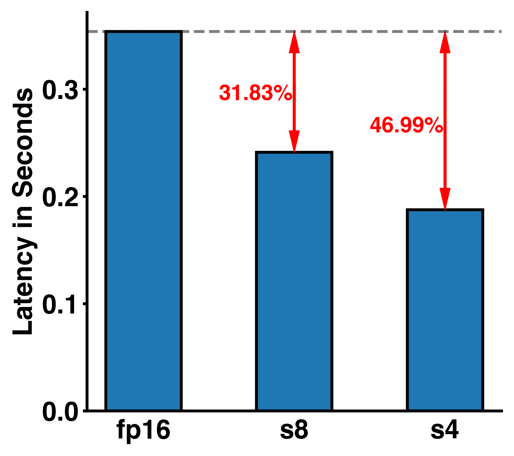
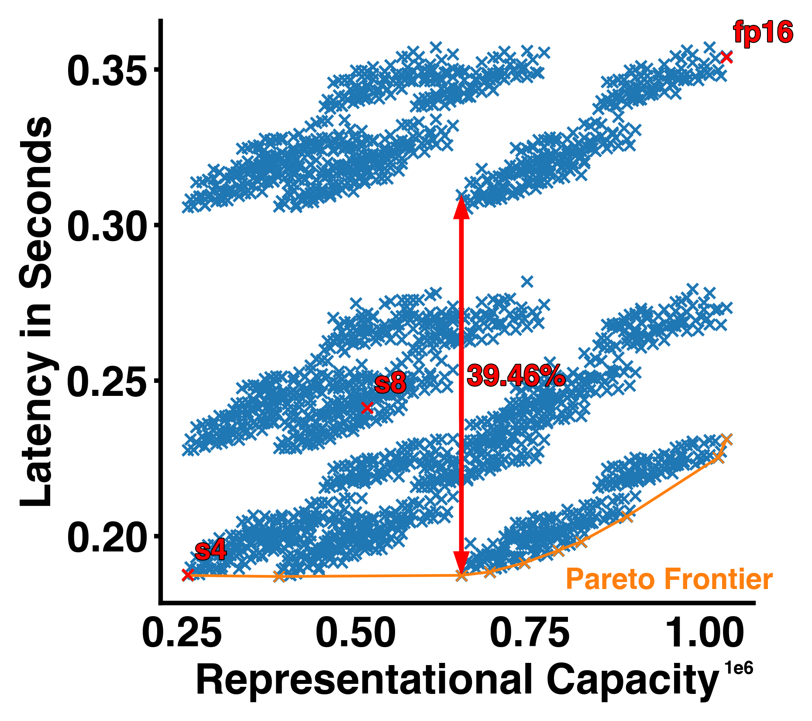

# Speeding Up Neural Networks with Quantization

### Why do we need machine learning acceleration?

As artificial intelligence (AI), particularly machine learning (ML), continues to advance rapidly, the demand for efficient processing of large datasets and models has become increasingly critical. Especially the ability to quickly and efficiently process neural network (NN) has become an essential factor in achieving high performance in applications such as image recognition ([Vision Transformers](https://arxiv.org/abs/2010.11929)), natural language processing ([Bert](https://arxiv.org/abs/1810.04805)), generative AI ([stable diffusion]( https://arxiv.org/abs/2112.10752) and [GPT]( https://arxiv.org/pdf/2005.14165.pdf)), and robotics(e.g. [reinforcement learning](https://www.ri.cmu.edu/pub_files/2013/7/Kober_IJRR_2013.pdf). The main driver for scaling ML systems so far has been better hardware accelerators such as GPUs or TPUs which specialized in matrix operation. Those systems got better amongst other factors through smaller technology nodes provided by foundries. For example, for data center GPUs NVIDIA used 90nm node for their Tesla architecture in 2007 meanwhile in their 2022 Hopper architecture is fabricated using a 4nm FinFET process. Since scaling technology nodes is likely to slow down (end of Moore’s law, got predicted many times but eventually it has to be true, no?) but demand for ML acceleration is likely to increase even further other ways for ML acceleration will come into play. 

### What is quantization?

Enter quantization a technique originally from signal processing which maps a large set (possibly even continuous) of values to a smaller set of values. The idea thereby being that a smaller set of values requires fewer bits for digital representation and hence cheaper hardware primitives can be used and memory as well as bandwidth requirements are reduced. Thereby resulting in lower latencies or lower energy requirements enabling deployment in resource constraint environments. Quantization is especially interesting for neural networks since they demonstrate robustness towards noise and in some case even benefit from it as [regularization method](https://proceedings.neurips.cc/paper/2017/file/217e342fc01668b10cb1188d40d3370e-Paper.pdf). There has been a plethora of work on how to quantize NNs in various ways, i.e. post-training quantization (PTQ) or quantization aware training (QAT), see this [NVIDIA]() or [QUALCOMM]() white paper for in depth explanations. However, one common criticism authors of such works (including myself) are facing regularly is the applicability of quantization to production settings. In this blog post I want to make the case for how quantization is already relevant and can be used with modern GPU systems.

### Where does quantization stand today?

Practically speaking the most used precision for NN today are 16bit floating point formats, either as Google’s BFloat16 (which has an optimized mantissa-exponent bit distribution for NNs) or standard IEEE fp16. Which in case of PyTorch are conveniently provided through the [AMP]( https://pytorch.org/docs/stable/amp.html) package and are supported by most modern ML systems and usually forms the baseline for quantization works which explore bit-widths below 16bits. Unfortunately, In the low-bit width regime there is only limited support for end users. A common argument is that quantization research wants to inform future hardware design or is meant for custom ASIC designs thereby rendering it irrelevant for ML practitioner. However, with [NVIDIA’s release]( https://developer.nvidia.com/blog/nvidia-ampere-architecture-in-depth/) of the ampere architecture (used for example in the A100 GPU) there is hardware support for 4bit and 8bit operation matrix operations bring low bit quantization in the reach of users! The actual use of 4 bit operations is still a little tedious since no major deep learning framework supports int4 operations. 

### How can I use low bit-width operations?

Let’s have a look at the actual speed ups we can achieve by using lower precision operations on the A100. To do so we are going to use [PyCutlass interface]( https://github.com/NVIDIA/cutlass/tree/master/examples/40_cutlass_py) (a little bit hidden in the cutlass repository) which allows us to run custom cutlass kernel for matrix operations on the GPU (e.g. calling reduced precision operations). The following code demonstrates the setup of int8 multiply accumulate operation. We set up two input matrices with 8 bits and an output matrix with 32 bits (high precision accumulators), keeping track of all details such as thread block shape, number of warps within dimension etc. is not trivial and can be area for optimization (keep in mind that the hardware must support the operation you are trying construct here). Finally, there are some options for the epilogue where activations functions or batch normalization operations could be implemented. The code would look somewhat like this:

```python
alignment = 8
# Set up A, B, C and accumulator
tensor_a = pycutlass.TensorDescription(
  cutlass.int8, cutlass.RowMajor, alignment
)
tensor_b = pycutlass.TensorDescription(
  cutlass.int8, cutlass.ColumnMajor, alignment
)
tensor_c = pycutlass.TensorDescription(
  cutlass.int32, cutlass.RowMajor, alignment
)
element_acc = cutlass.int32
element_epilogue = cutlass.int32

math_inst = pycutlass.MathInstruction(
  [16, 8, 32],
  tensor_a.element,
  tensor_b.element,
  element_acc,
  cutlass.OpClass.TensorOp,
  pycutlass.MathOperation.multiply_add,
)

tile_description = pycutlass.TileDescription(
  # Threadblock shape, Number of stages, Number of warps within each dimension
  # of the threadblock shape
  [256, 128, 128], 3, [2, 2, 1,], math_inst,
)

epilogue_functor = pycutlass.LinearCombination(
  tensor_c.element, tensor_c.alignment, element_acc, element_epilogue
)

pycutlass.GemmOperationUniversal(
  arch=cc,
  tile_description=tile_description,
  A=tensor_a,
  B=tensor_b,
  C=tensor_c,
  epilogue_functor=epilogue_functor,
)
```

### How much speed up can we get?

Assuming a simple 6 layer fully connected neural network (activation dimension as 32768-16384-8192-4096-2048-1024-32768) we can now run it with different supported bit-widths of the A100 (fp16, int8, and int4). The figure below shows us the latency in seconds of a single NN forward pass. We can see a ~31% and ~47% reduction in latency for int8 and int4 respectively compared to the fp16 model. Unsurprisingly we get some latency gains by using fewer bits for the matrix operations in our simple NN.

<p align="center">

</p>

### Can we have finer trade-off?

The latency improvements we have seen so far are all or nothing, either we run the entire NN at 8, 4, or 16 bits. Hence, we also only have two options for improvement and in case the NN is not able to produce the desired accuracy with only 4 or 8 bits there isn’t much we can do. Lucky us we can configure the bit precision per layer. We can achieve a lot finer trade-off between model size/latency and “performance” when we consider all the configuration options given customizable bit-widths per NN layer. The quantization configuration space given our tiny NN is indeed very big 3^6 = 729 (3 bit-widths and 6 layers). In the figure below we visualize the latency of all those configurations against the “representational capacity” of the NN (the activation dimension times their respective bit-width added up). We can see a pareto frontier forming which gives us the best latency for a given representational capacity and we can indeed see that most configuration do not lie on that curve and are sometimes not even close. For example, the red double headed arrow highlights the difference between two points with the exact same representational capacity but ~39% difference in latency! 

<p align="center">

</p>

### I want to know more!

Given this big space of quantization configuration with different latencies and representational capacities parts the real challenge becomes how do we trade-off quantization and model performance. In this blog post we use representational capacity without linking it to any practical NN performance in terms of accuracy or generative power metric. This is mainly because this relationship is not straight forward, but it can be exploited with clever methods which I work on in my PhD research. If you are interested, you can have a look at two representative papers of my work:

1. [Edge Inference with Fully Differentiable Quantized Mixed Precision Neural Networks]( https://arxiv.org/pdf/2206.07741)
2. [Mixed Precision Post Training Quantization of Neural Networks with Sensitivity Guided Search]( https://arxiv.org/pdf/2302.01382)

I hope in this blog post I was able to motivate why quantization work is interesting and show how it can have real production impact already.


### Full Code

```python
import copy
import time

from absl import app
from absl import flags
from absl import logging
import cutlass
import numpy as np
import pycutlass
from pycutlass.utils.device import device_cc

FLAGS = flags.FLAGS

flags.DEFINE_integer('batch_size', 2048, 'Batch size.')
flags.DEFINE_list('nn_config', ['fp16'] * 7, 'Precision for each layer of NN.')
flags.DEFINE_list(
    'nn_size',
    [2**i for i in range(15, 9, -1)] + [2**15],
    'Size of each Layer.',
)


def create_mvm16(cc):
  # Create fp16 kernel
  alignment = 8
  # Set up A, B, C and accumulator
  tensor_a = pycutlass.TensorDescription(
      cutlass.float16, cutlass.RowMajor, alignment
  )
  tensor_b = pycutlass.TensorDescription(
      cutlass.float16, cutlass.ColumnMajor, alignment
  )
  tensor_c = pycutlass.TensorDescription(
      cutlass.float32, cutlass.RowMajor, alignment
  )
  element_acc = cutlass.float32
  element_epilogue = cutlass.float32

  math_inst = pycutlass.MathInstruction(
      [16, 8, 16],  # InstructionShape
      tensor_a.element,
      tensor_b.element,
      element_acc,
      cutlass.OpClass.TensorOp,
      pycutlass.MathOperation.multiply_add,
  )

  tile_description = pycutlass.TileDescription(
      # Threadblock shape, Number of stages, Number of warps within each dimension
      # of the threadblock shape
      [256, 128, 64], 3, [2, 2, 1,],
      math_inst,
  )

  epilogue_functor = pycutlass.LinearCombination(
      tensor_c.element, tensor_c.alignment, element_acc, element_epilogue
  )

  return pycutlass.GemmOperationUniversal(
      arch=cc,
      tile_description=tile_description,
      A=tensor_a,
      B=tensor_b,
      C=tensor_c,
      epilogue_functor=epilogue_functor,
  )


def create_mvm8(cc):
  # Create int8 kernel
  alignment = 8
  # Set up A, B, C and accumulator
  tensor_a = pycutlass.TensorDescription(
      cutlass.int8, cutlass.RowMajor, alignment
  )
  tensor_b = pycutlass.TensorDescription(
      cutlass.int8, cutlass.ColumnMajor, alignment
  )
  tensor_c = pycutlass.TensorDescription(
      cutlass.int32, cutlass.RowMajor, alignment
  )
  element_acc = cutlass.int32
  element_epilogue = cutlass.int32

  math_inst = pycutlass.MathInstruction(
      [16, 8, 32],
      tensor_a.element,
      tensor_b.element,
      element_acc,
      cutlass.OpClass.TensorOp,
      pycutlass.MathOperation.multiply_add,
  )

  tile_description = pycutlass.TileDescription(
      # Threadblock shape, Number of stages, Number of warps within each dimension
      # of the threadblock shape
      [256, 128, 128], 3, [2, 2, 1,], math_inst,
  )

  epilogue_functor = pycutlass.LinearCombination(
      tensor_c.element, tensor_c.alignment, element_acc, element_epilogue
  )

  return pycutlass.GemmOperationUniversal(
      arch=cc,
      tile_description=tile_description,
      A=tensor_a,
      B=tensor_b,
      C=tensor_c,
      epilogue_functor=epilogue_functor,
  )


def create_mvm4(cc):
  # Create int8 kernel
  alignment = 16
  # Set up A, B, C and accumulator
  tensor_a = pycutlass.TensorDescription(
      cutlass.dtype.s4, cutlass.RowMajor, alignment
  )
  tensor_b = pycutlass.TensorDescription(
      cutlass.dtype.s4, cutlass.ColumnMajor, alignment
  )
  tensor_c = pycutlass.TensorDescription(
      cutlass.int32, cutlass.RowMajor, alignment
  )
  element_acc = cutlass.int32
  element_epilogue = cutlass.int32

  math_inst = pycutlass.MathInstruction(
      [16, 8, 64],  # InstructionShape
      tensor_a.element,
      tensor_b.element,
      element_acc,
      cutlass.OpClass.TensorOp,
      pycutlass.MathOperation.multiply_add,
  )

  tile_description = pycutlass.TileDescription(
      # Threadblock shape, Number of stages, Number of warps within each dimension
      # of the threadblock shape
      [128, 256, 256], 3, [2, 2, 1,], math_inst,
  )

  epilogue_functor = pycutlass.LinearCombination(
      tensor_c.element, tensor_c.alignment, element_acc, element_epilogue
  )

  return pycutlass.GemmOperationUniversal(
      arch=cc,
      tile_description=tile_description,
      A=tensor_a,
      B=tensor_b,
      C=tensor_c,
      epilogue_functor=epilogue_functor,
  )


def main(argv):
  
  logging.info('NN configuration: ')
  logging.info(FLAGS.flag_values_dict().items())
  
  cc = device_cc()
  assert cc >= 80, (
      'Our CUTLASS Python mixed precision example requires compute capability'
      ' greater than or equal to 80.'
  )

  np.random.seed(0)

  # Allocate a pool of device memory to be used by the kernel
  pycutlass.get_memory_pool(init_pool_size=2**34, max_pool_size=2**36)

  # Set the compiler to use to NVCC
  pycutlass.compiler.nvcc()

  mvm_fp16 = create_mvm16(cc)
  mvm_s8 = create_mvm8(cc)
  mvm_s4 = create_mvm4(cc)

  operations = [mvm_fp16, mvm_s8, mvm_s4]

  # Compile the operation
  logging.info('Compiling cutlass kernels...')
  pycutlass.compiler.add_module(operations)

  op_lookup = {'s8': mvm_s8, 's4': mvm_s4, 'fp16': mvm_fp16}
  inp_dtype_lookup = {'s8': np.int8, 's4': np.int8, 'fp16': np.float16}
  oacc_dtype_lookup = {'s8': np.int32, 's4': np.int32, 'fp16': np.float32}

  logging.info('Creating tensors...')
  args_list = []
  for i, v in enumerate(FLAGS.nn_config[:-1]):
    if i == 0:
      # generate input for first layer
      tensor_A = np.ceil(
          np.random.uniform(
              low=-8.5, high=7.5, size=(FLAGS.batch_size * FLAGS.nn_size[0],)
          )
      ).astype(inp_dtype_lookup[FLAGS.nn_config[i]])
    else:
      # subsequent layers use previous layer output as input
      tensor_A = copy.deepcopy(tensor_D)
    tensor_B = np.ceil(
        np.random.uniform(
            low=-8.5, high=7.5, size=(FLAGS.nn_size[i] * FLAGS.nn_size[i + 1],)
        )
    ).astype(inp_dtype_lookup[FLAGS.nn_config[i]])
    tensor_C = np.ceil(
        np.random.uniform(
            low=-8.5, high=7.5, size=(FLAGS.batch_size * FLAGS.nn_size[i + 1],)
        )
    ).astype(oacc_dtype_lookup[FLAGS.nn_config[i]])
    tensor_D = np.zeros(shape=(FLAGS.batch_size * FLAGS.nn_size[i + 1])).astype(
        oacc_dtype_lookup[FLAGS.nn_config[i]]
    )

    problem_size = cutlass.gemm.GemmCoord(
        FLAGS.batch_size, FLAGS.nn_size[i + 1], FLAGS.nn_size[i]
    )

    args_list.append(
        pycutlass.GemmArguments(
            operation=op_lookup[FLAGS.nn_config[0]],
            problem_size=problem_size,
            A=tensor_A,
            B=tensor_B,
            C=tensor_C,
            D=tensor_D,
            output_op=op_lookup[FLAGS.nn_config[0]].epilogue_type(0.0, 0.0),
        )
    )

  # run NN multiple times to get an good estimate for run time.
  runtimes = []
  logging.info('Start eval...')
  for i in range(30):
    start = time.time()
    # run NN
    for i, v in enumerate(FLAGS.nn_config[:-1]):
      op_lookup[FLAGS.nn_config[i]].run(args_list[i])
    args_list[-1].sync()
    runtimes.append(time.time() - start)

  logging.info('NN took %f+/-%f seconds.', np.mean(runtimes), np.std(runtimes))


if __name__ == '__main__':
  app.run(main)
```